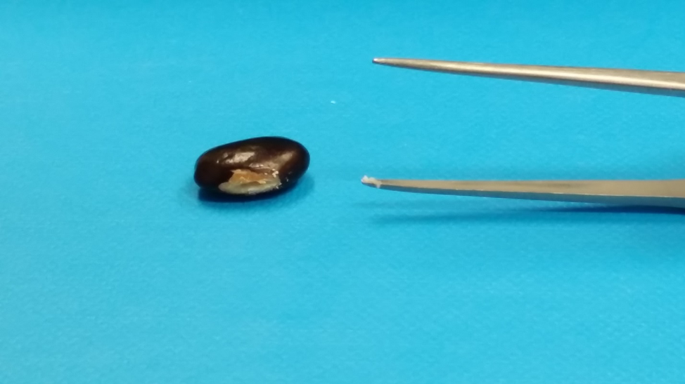

## SAFETY INFORMATION
Before you start, look up the MSDS sheets for all the chemicals used in this protocol.  Ensure you follow any recommendations/rules regarding wearing personal protective equipment, emergency procedures, and clean-up/disposal procedures.  If you have any questions contact your supervisor or lab manager.

### This protocol provides a quick means to extract PCR-only quality DNA from a large number of samples.
## Supplies needed:
-	Tweezers
-	Toothpicks
-	Sterile Water
-	96-well PCR micro-plate
-	Heating block set to 95°C
-	0.5M Tris-HCL (pH 8.0)
-	0.25M NaOH

## Protocol:
Photo of a bean with the seed coat scraped away on the front side.There is a small amount of cotyledon tissue on the tweezers to demonstrate the amount you need for extraction. Try to keep this amount consistent between samples. Ensure you only take a sample of the cotyledon and do not damage the embryo. 

1.	Using Tweezers (or a Razor Blade or Scalpel – whichever you find easiest), chip off a small area of seed coat to expose the cotyledons.
-	For beans and lentils, seed coat tissue is derived from maternal parent and does not represent genotype of the embryo.  Therefore avoid contaminating sample with seed coat tissue.
-	Avoid damaging the embryo when chipping the seed coat.
2.	Place a 96-well PCR micro-plate on ice.  Add 2 µl of sterile water to each well.
3.	Add a small 1-2 µl drop of water to the exposed section of the cotyledon.  It is typically best to line up a series of seeds at once.
4.	Using a clean toothpick scrape a small amount of seed flour.  Transfer the collected sample into the PCR well by dipping and gently swirling the toothpick into the water at the bottom of the sample well.  
-	Only a small amount of flour is needed.  More is NOT better.
-	Be as consistent as possible with regards to the amount of tissue being collected.
5.	Repeat Steps 3-5 until all samples are collected.  
6.	Once all samples are collected add 10 µl of 0.25M NaOH to each well.
7.	Seal samples.  Shake/Vortex briefly on plate-mixer if available.  Place plate on 95°C heating block for ~2 minutes.  Remove and leave at room temperature.
8.	Carefully remove seal and add 15 µl of 0.5M Tris-HCl (pH 8.0) to each well.
9.	Seal the samples.  Shake/vortex on plate-mixer if available.  Place plate on 95°C heating block for ~2 minutes.  Remove and place on ice.
10.	Samples can be used immediately, stored in the fridge for a few days, or frozen indefinitely.  
11.	For regular PCR, use 1.0-2.0 µl of sample in a 15-25 µl PCR reaction.  For KASP-based PCR, dilute the DNA by adding 100 µl of sterile water.  Then use 2.0 µl of diluted DNA in a 8-10 µl KASP reaction.

## Important Notes:
-	For best results, try to be as consistent as possible with the amount of tissue collected.   As with any PCR, KASP-based PCR works best when starting samples have same amounts of DNA.  By being consistent, you should not have to quantify the DNA.

