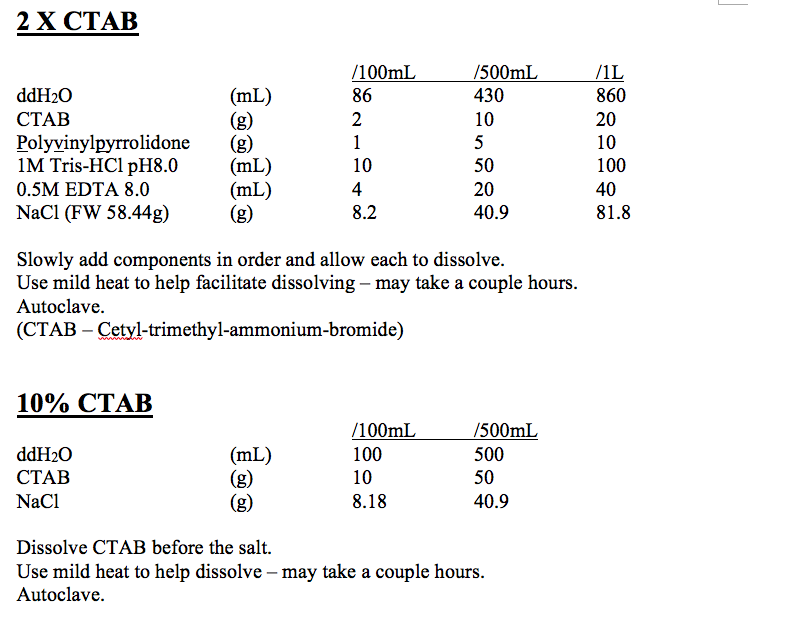
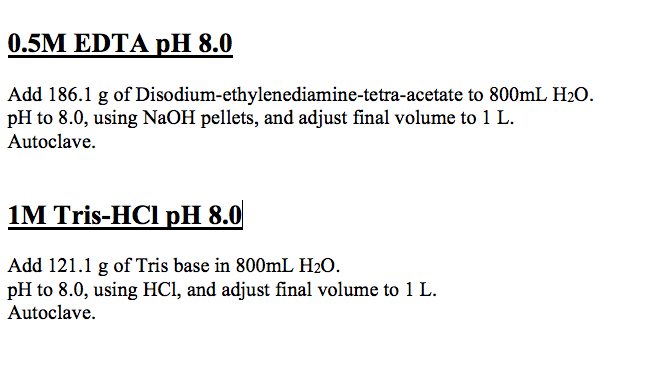

## SAFETY INFORMATION
before you start, look up the MSDS sheets for all the chemicals used in this protocol.  Ensure you follow any recommendations/rules regarding wearing personal protective equipment,
emergency procedures, and clean-up/disposal procedures.  If you have any questions contact your supervisor or lab manager.

## The following protocol can be used to extract DNA from all pulse crops.

1. Collect a small coleoptile (2.5 cm) or leaf tissue (~100 mg) sample from the plant.  The tissue should be placed in a 1.5 mL micro-centrifuge tube and placed on ice.
2. Grind the plant tissue in the tube using a sterile micro-pestle.
3. Add 500 µl of 65&deg;C 2X CTAB Extraction Buffer.  Mix thoroughly by inversion.  
4. Incubate tubes in a 65&deg;C water bath for 5-10 minutes.
5. Add 500 µl of chloroform/isoamyl-alcohol (24:1).  Gently mix the 2 phases together.
6. Centrifuge the samples @ 13 000 rpm for 10 minutes.
7. Transfer the upper, aqueous phase to a new 1.5 mL micro-centrifuge tube.
8. Add 1/10 volume (~50 µl or 2-3 small drops) of 65&ordm;C 10% CTAB extraction buffer.  Mix thoroughly by inversion.
9. Incubate tubes in a 65&deg;C water bath for 5-10 minutes.
10. Add 500 µl of chloroform/isoamyl-alcohol (24:1).  Gently mix the 2 phases together.
11. Centrifuge the samples @ 13 000 rpm for 10 minutes.
12. Transfer the upper, aqueous phase to a new 1.5 mL micro-centrifuge tube.
13. Add 800 µl of cold 95% ethanol.  Mix thoroughly and place @ -20&deg;C 30 minutes.
14. Centrifuge the samples @ 13 000 rpm for 10 minutes.
15. Decant the ethanol and add 500 µl of cold 70% ethanol.  Mix thoroughly and place @ -20&deg;C for 5-15 minutes
16. Centrifuge the samples @ 13 000 rpm for 10 minutes.
17. Pipette off the ethanol and let tubes air dry. Alternatively a speed-vac can be used.
18. Resuspend DNA in 100 µl of sterile H2O.
19. Add 1 &micro;l of 10 mg/mL RNAse A.  

## Notes:
-	Samples can be left O/N after adding the ethanol in step 13 or 15.
-	While samples are incubating in the 65&ordm;C H2O bath, they should periodically be mixed by inversion.
-	Can expect an average product of ~200-400 ng/µl (x100µl) = 20 – 40 µg
-	Have gotten over 1000 ng/µl = 100 µg.
-	Final tubes should be labeled with complete name (for varieties) or population and line number (not entry number).

